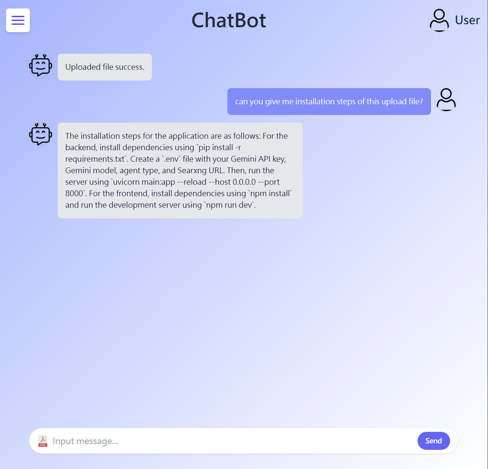

# Smart ChatBot Web Application
This project is an AI-powered chatbot web application, combining a FastAPI backend with a Vue 3 frontend.

The application supports real-time AI chat, PDF document upload and retrieval, as well as variable parsing and computation—providing users with an interactive and intelligent experience.

The backend handles AI reasoning logic, including Gemini API integration, PDF knowledge retrieval, and variable analysis. The frontend offers a fast and responsive user interface with login, chat, and file upload capabilities.

---

## Features

- Integrated **Gemini LLM API** into the web app to build a complete end-to-end AI chatbot.
- Used **LangChain** to create a ReAct-style **LLM Agent** with multi-tool reasoning.
- Developed and registered custom LangChain tools:
  - **PDF Retrieval Tool**: Semantic search across uploaded PDF content.
  - **Variable Computation Tool**: Supports user-defined expressions and logic.
- Maintains conversation history with **ConversationBufferMemory** and token-based session tracking.
- Allows document upload and **RAG (Retrieval-Augmented Generation)** functionality for enhanced factual accuracy.

---

## Tech Stack

### AI / LLM

- Gemini API (Gemini-2.0-flash)
- LangChain
- RAG
- ReAct agent

### Frontend

- Vue 3
- Tailwind CSS
- RWD

### Backend

- FastAPI

### Other

- Version Control: git
- Web Server: nginx
- Python: 3.11+

## Project Structure

backend/
├── .env
├── requirements.txt
├── main.py
├── agent/
│ ├── chat_agent.py
│ ├── pdf_search_tool.py
│ └── variable_tool.py

frontend/
├── index.html
├── src/
│ ├── app.vue
│ ├── views/
│ │ ├── chatpage.vue
│ │ └── loginpage.vue
│ └── assets/

## Installation

### Backend Setup

1. Install dependencies via `pip install -r requirements.txt`.
2. Create a `.env` file with your Gemini API key, Gemini model, use agent type and searxng url.
3. Run the backend server with:
uvicorn main:app --reload --host 0.0.0.0 --port 8000

### Frontend Setup

1. Install dependencies via `npm install`.
2. Run the frontend dev server with:
npm run dev

## Images

